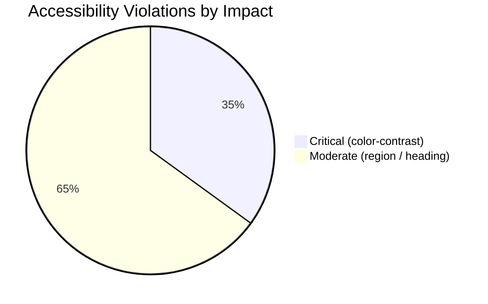

# Design Review Results: Sable — Library (`/`) & Editor (`/editor`)

**Review Date**: 2026-03-04  
**Routes**: `/` (Library), `/editor` (Editor)  
**Focus Areas**: Visual Design · UX/Usability · Accessibility · Micro-interactions/Motion · Consistency · Performance

---

## Summary

Sable has a beautifully distinct handcrafted/notebook design language with excellent GSAP animations, a coherent color palette, and thoughtful micro-details (wobbly borders, torn-paper effects, dot-grid background). However, there are critical accessibility failures (contrast violations confirmed by axe-core), a severe first-load performance issue (FCP ~3.5s on the library page), and a number of UX friction points — most notably the native `window.prompt()` for link insertion and a 5px-wide sketchpad trigger. Consistency in border radii, font usage, and ARIA landmark structure also needs attention.

---

## Issues

| # | Issue | Criticality | Category | Location |
|---|-------|-------------|----------|----------|
| 1 | Word count stat labels ("Words", "Characters", "Paragraphs", "Read time") have 2.6:1 contrast ratio against white — needs 4.5:1 (WCAG AA) | 🔴 Critical | Accessibility | `components/editor/WordCountBadge.tsx` (text-gray-400 / text-[10px]) |
| 2 | "Quick Ideas" label on peach (`#fdba74`) background: 3.82:1 contrast, below 4.5:1 threshold | 🔴 Critical | Accessibility | Sketchpad panel (text-ink/70 on bg-peach) |
| 3 | "0 chars" on peach background: 2.02:1 contrast — severely insufficient | 🔴 Critical | Accessibility | Sketchpad panel (text-ink/40 on bg-peach) |
| 4 | "0 pins" in Mood Board footer: 2.6:1 contrast on white | 🔴 Critical | Accessibility | MoodBoard panel footer (text-xs text-gray-400) |
| 5 | Library FCP is 3468ms and TTFB is 2885ms — users wait 3.5 seconds before seeing any content | 🔴 Critical | Performance | `app/page.tsx` — `'use client'` on root page prevents server-side rendering benefits; dev server in use; warrants prod build profiling |
| 6 | Search input has no `<label>` element — only `placeholder` text. Screen readers cannot describe the field without a visible label | 🔴 Critical | Accessibility | `app/page.tsx:93-111` |
| 7 | `window.prompt()` used for link URL insertion in the BubbleMenu — native browser dialog breaks the app's design language and is inaccessible | 🟠 High | UX/Usability | `components/editor/TiptapEditor.tsx:405-409` |
| 8 | Right-edge sketchpad trigger is only 5px wide (`w-5`) — extremely difficult to click on trackpads and touch devices | 🟠 High | UX/Usability | `components/editor/EditorCanvas.tsx:188-194` |
| 9 | Tab bar buttons (`Recent`, `Favorites`, `Archived`) do not use proper ARIA roles: missing `role="tablist"`, `role="tab"`, and `aria-selected` attributes | 🟠 High | Accessibility | `app/page.tsx:128-156` |
| 10 | `DocumentMenu` dropdown uses raw `
` without `role="menu"` / `role="menuitem"` — not keyboard-navigable (no arrow-key support) | 🟠 High | Accessibility | `components/library/DocumentMenu.tsx:42-112` |
| 11 | `PublishModal` has no `role="dialog"` or `aria-modal="true"` — screen readers won't announce it as a dialog | 🟠 High | Accessibility | `components/editor/PublishModal.tsx:41-141` |
| 12 | Settings overlay has no focus trap — keyboard focus can escape outside the panel while it is open | 🟠 High | Accessibility | `components/editor/SettingsOverlay.tsx` |
| 13 | Grammar tooltip (`grammarTooltip`) has no keyboard dismissal (Escape key) and no `role="tooltip"` | 🟠 High | Accessibility | `components/editor/TiptapEditor.tsx:464-491` |
| 14 | `recharts` and `react-activity-calendar` are eagerly imported at the top of `WritingStatsPanel` — both are large bundles loaded on every page visit even when the panel is collapsed. Should be lazy-loaded | 🟠 High | Performance | `components/library/WritingStatsPanel.tsx:4-13` |
| 15 | 10 Google Fonts are loaded simultaneously in `layout.tsx` (Varela Round, Nunito, Patrick Hand, Fira Code, Manrope, Lora, Merriweather, Caveat, Kalam, Special Elite) — adds significant render-blocking weight. Audit and remove unused fonts | 🟠 High | Performance | `app/layout.tsx:3-76` |
| 16 | Stat card label text (`text-[10px] font-marker text-gray-500`) uses 10px font — below the 12px minimum recommended for readability | 🟡 Medium | Visual Design | `components/library/WritingStatsPanel.tsx:162` |
| 17 | Decorative avatar (top-right of library header) is `opacity-40 pointer-events-none` but visually looks like an actionable user avatar — can confuse users who try to click it | 🟡 Medium | UX/Usability | `app/page.tsx:113-119` |
| 18 | Decorative avatar has no `aria-hidden="true"` — it will be announced by screen readers despite carrying no information | 🟡 Medium | Accessibility | `app/page.tsx:113-119` |
| 19 | Editor page has no `<h1>` element — violates WCAG best practices; the document title shown in the toolbar is not in the DOM as a heading | 🟡 Medium | Accessibility | `app/editor/EditorPageClient.tsx`, `components/editor/EditorCanvas.tsx` |
| 20 | Toolbar elements (links, buttons), Sketchpad panel, and Mood Board panel are not contained within ARIA landmarks — confirmed by axe-core audit | 🟡 Medium | Accessibility | `components/editor/EditorToolbar.tsx`, `components/editor/EditorCanvas.tsx` |
| 21 | Editor canvas has no visible "paper" affordance — the white writing area blends into the white page background with no border or drop shadow to indicate it is an editable zone | 🟡 Medium | Visual Design | `components/editor/EditorCanvas.tsx:139-160` |
| 22 | "Mood Board" button text wraps to two lines (`Mood\nBoard`) at 1280px viewport width due to overflow in the fixed-width toolbar | 🟡 Medium | Visual Design | `components/editor/EditorToolbar.tsx:211-219` |
| 23 | `WritingStatsPanel` uses hardcoded Tailwind colors outside the design token system: `bg-orange-50`, `text-orange-500`, `bg-amber-50`, `text-amber-500` | 🟡 Medium | Consistency | `components/library/WritingStatsPanel.tsx:58-91` |
| 24 | Active search query is not cleared when switching tabs — users on "Favorites" tab see "No favorites yet" with no indication that a search filter is active | 🟡 Medium | UX/Usability | `app/page.tsx:42-63` |
| 25 | GSAP animations and CSS `transition` are mixed inconsistently: toolbar slide uses CSS `transition-transform`, footer FAB entrance uses GSAP `.fromTo()` | 🟡 Medium | Micro-interactions | `components/editor/EditorToolbar.tsx:99-107`, `components/editor/EditorCanvas.tsx:49-61` |
| 26 | `WritingStatsPanel` accordion opens with no animation — an abrupt layout shift that contrasts with the app's polished animation style | 🟡 Medium | Micro-interactions | `components/library/WritingStatsPanel.tsx:138-261` |
| 27 | 8+ different border-radius values in use (`rounded-rough`, `rounded-rough-sm`, `rounded-notebook`, `rounded-wobble`, `rounded-xl`, `rounded-lg`, `rounded-full`, `rounded-md`) — inconsistent across similarly-purposed elements | 🟡 Medium | Consistency | `app/globals.css`, multiple components |
| 28 | `html2pdf.js` is not lazily imported in `lib/export.ts` — it's a large library (~1MB) that should only be loaded when the user actually triggers a PDF export | 🟡 Medium | Performance | `lib/export.ts` |
| 29 | Toolbar is entirely hidden unless the user hovers over the top 80px — not discoverable for first-time users; no tooltip or visual hint indicating it exists | 🟡 Medium | UX/Usability | `components/editor/EditorToolbar.tsx:94-108` |
| 30 | Modal backdrop inconsistency: `NewDocumentCard` dialog uses `bg-ink/30`, `PublishModal` uses `bg-white/30` | ⚪ Low | Consistency | `components/library/NewDocumentCard.tsx:49`, `components/editor/PublishModal.tsx:43` |
| 31 | Tab underline indicator uses hardcoded `-bottom-[18px]` pixel value — fragile and will break if font-size or padding changes | ⚪ Low | Visual Design | `app/page.tsx:140-142` |
| 32 | "Welcome back, Writer" — hardcoded name "Writer" is generic; no personalization even with a stored display name | ⚪ Low | UX/Usability | `app/page.tsx:83` |
| 33 | Sort button has no visual direction indicator (up/down arrow) to communicate current sort direction — only text label changes | ⚪ Low | UX/Usability | `app/page.tsx:147-155` |
| 34 | `btn-magnetic` FABs have a `hover` lift effect but no distinct `:active` / pressed state — user gets no tactile press feedback | ⚪ Low | Micro-interactions | `app/globals.css:342-353` |
| 35 | Toolbar GSAP stagger (`stagger: 0.05`) fires on every editor mount including fast navigations — can feel redundant on return visits | ⚪ Low | Performance | `components/editor/EditorToolbar.tsx:53-57` |

---

## Criticality Legend

- 🔴 **Critical**: Breaks functionality, violates WCAG AA accessibility standards, or severely degrades user experience
- 🟠 **High**: Significantly impacts usability, design quality, or keyboard/screen-reader access
- 🟡 **Medium**: Noticeable issue that degrades polish or consistency
- ⚪ **Low**: Nice-to-have improvement or minor inconsistency

---

## Next Steps (Suggested Priority Order)

### Phase 1 — Accessibility Fixes (Critical)
1. Fix all confirmed color contrast violations (#1–4, #6): bump `text-gray-400` labels to `text-gray-600` minimum, or use darker surfaces
2. Add `<label>` to the library search input (#6)
3. Add `role="tablist"` / `role="tab"` / `aria-selected` to the tab bar (#9)
4. Add `aria-hidden="true"` to decorative avatar (#18)

### Phase 2 — UX Friction Removal (High)
5. Replace `window.prompt()` with an inline URL input popover (#7)
6. Increase sketchpad edge trigger to at least `w-8` with a visible drag handle (#8)
7. Add focus trapping to `SettingsOverlay` and `PublishModal`; add `role="dialog"` to modals (#11, #12)
8. Add `role="menu"` / `role="menuitem"` + keyboard navigation to `DocumentMenu` (#10)

### Phase 3 — Performance (High)
9. Lazy-load `recharts` + `react-activity-calendar` with `next/dynamic` (#14)
10. Audit and remove unused fonts from `layout.tsx` — keep only 3–4 core fonts (#15)
11. Lazy-import `html2pdf.js` inside the export function (#28)

### Phase 4 — Consistency & Polish (Medium)
12. Add a slide animation to the `WritingStatsPanel` accordion (#26)
13. Unify toolbar button overflow so "Mood Board" does not wrap (#22)
14. Normalise border-radius usage to 4–5 meaningful tokens (#27)
15. Clear search when switching tabs or show a "search active" badge (#24)

---

## Accessibility Audit Snapshot (axe-core 4.11.1 — `/editor`)

| Rule | Impact | Occurrences |
|------|--------|-------------|
| `color-contrast` | Serious | 7 nodes |
| `region` (landmarks) | Moderate | 12 nodes |
| `page-has-heading-one` | Moderate | 1 node |
