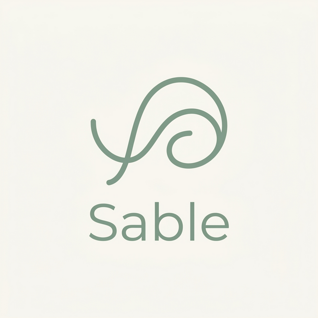
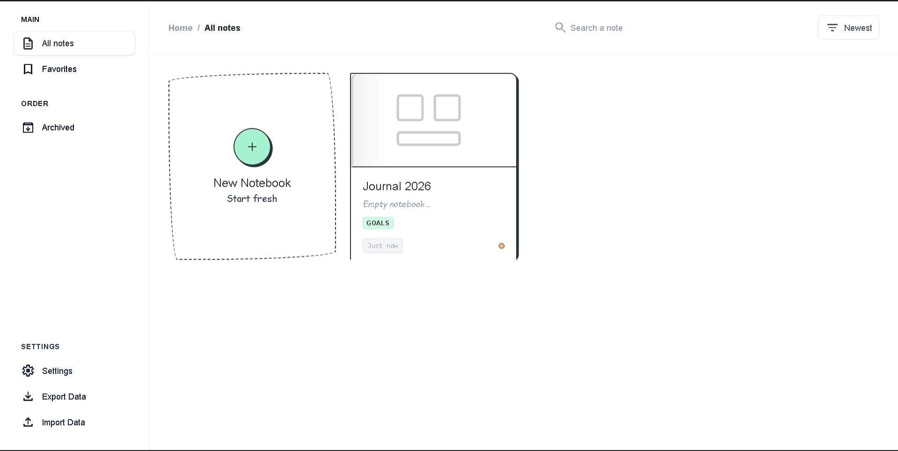
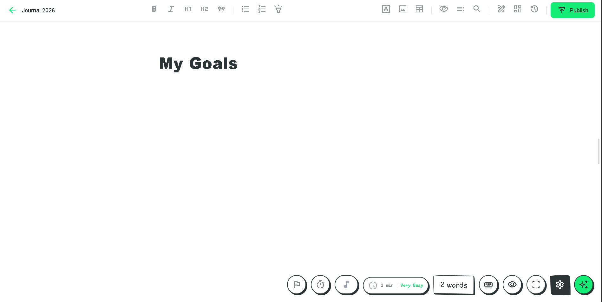
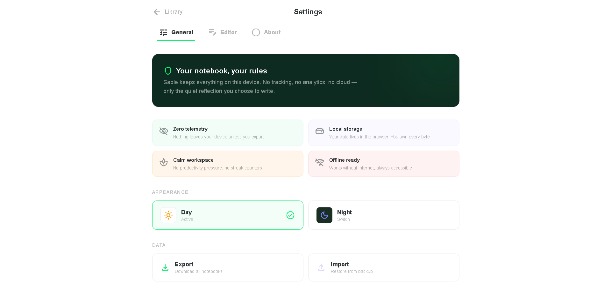
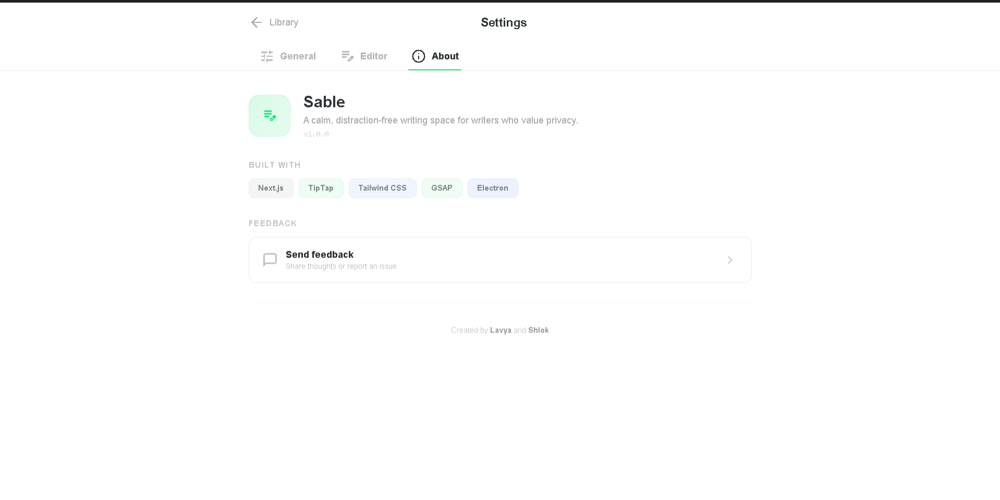

<p align="center">
  
</p>

<h1 align="center">Sable</h1>

<p align="center">
  <em>A calm, distraction-free writing space for writers who value privacy.</em>
</p>

<p align="center">
  <a href="#features">Features</a> •
  <a href="#screenshots">Screenshots</a> •
  <a href="#installation">Installation</a> •
  <a href="#development">Development</a> •
  <a href="#tech-stack">Tech Stack</a> •
  <a href="#architecture">Architecture</a> •
  <a href="#contributing">Contributing</a>
</p>

<p align="center">
  
  
  
  
  
</p>

---

## ✨ Overview

**Sable** is a local-first, privacy-focused writing application designed for novelists, journalists, bloggers, and anyone who wants a beautiful, distraction-free canvas for their words. Everything stays on your device — no accounts, no cloud sync, no telemetry. Just you and your writing.

Built with modern web technologies and packaged as a native desktop app via Electron, Sable delivers a premium writing experience with powerful tools that stay out of your way until you need them.

---

## 📸 Screenshots

<p align="center">
  
  <br />
  <em>📚 Document Library — Organize, search, and manage all your notebooks</em>
</p>

<p align="center">
  
  <br />
  <em>✍️ Editor — Rich text editing with a clean, focused interface</em>
</p>

<p align="center">
  
  <br />
  <em>⚙️ Settings — Your notebook, your rules</em>
</p>

<p align="center">
  
  <br />
  <em>ℹ️ About — Built with passion, built with purpose</em>
</p>

---

## 🚀 Features

### 📝 Rich Text Editor
- **Tiptap-powered** rich text editing with full formatting (bold, italic, headings, lists, blockquotes, and more)
- **Slash commands** — Type `/` to access AI actions, formatting, and editor tools inline
- **Image support** — Paste or drag-and-drop images directly into your document with resizable inline nodes
- **Table editing** — Insert and edit tables with an intuitive interface
- **Search & Replace** — Find and replace text across your document
- **Auto-save** — Your work is saved automatically with debounced persistence

### 🤖 AI Assistant (BYOK)
- **Bring Your Own Key** — Use your own API keys; they never leave your device
- **Multi-provider support:**
  | Provider | Models |
  |----------|--------|
  | OpenAI | GPT-4o Mini, GPT-4o, GPT-4.1 Mini, GPT-4.1 |
  | Google Gemini | Gemini 2.0 Flash, Gemini 2.5 Flash, Gemini 2.5 Pro |
  | Anthropic Claude | Claude 3.5 Haiku, Claude Sonnet 4, Claude Opus 4 |
- **Side-panel AI chat** for brainstorming, editing suggestions, and creative assistance
- **Slash-command AI actions** directly within the editor

### 🎯 Writing Productivity
- **Writing goals** — Set daily word count targets and track progress
- **Sprint timer** — Time-boxed writing sessions to boost productivity
- **Word count badge** — Live word count always visible
- **Readability badge** — Real-time readability scoring
- **Writing statistics** — Track your writing habits with detailed analytics
- **Activity calendar** — Visualize your writing streaks

### 🎨 Creative Tools
- **Mood board** — Collect and arrange visual inspiration for your projects
- **Sketchpad** — Quick freehand drawing canvas alongside your writing
- **Margin notes** — Paragraph-anchored side notes for annotations and reminders
- **Document outline** — Navigate long documents with an auto-generated heading outline
- **Notes / Scratchpad** — Per-document text scratchpad for loose ideas

### ✅ Grammar & Language
- **Inline grammar checking** powered by [LanguageTool](https://languagetool.org/)
- **Grammar suggestions** with inline highlighting and one-click fixes
- **Dictionary lookup** — Select any word to instantly look up its definition

### 🎵 Ambient Environment
- **Ambient soundscapes** — Rain, café, fireplace, lo-fi, and white noise
- **Keystroke sounds** — Satisfying typing sound effects with multiple themes
- **Volume controls** — Independent volume sliders for each
- **Focus mode** — Dim everything except the current paragraph
- **Typewriter mode** — Keep the active line centered on screen
- **Fullscreen mode** — Truly immersive, distraction-free writing

### 📤 Export & Publishing
- **PDF export** via print-optimized layout
- **Markdown export** with automatic HTML-to-Markdown conversion
- **HTML export** — Clean, portable HTML files
- **Zine / booklet-style** print layout for creative publishing
- **Tag management** within the publish workflow

### 📚 Document Library
- **All notes, Favorites, and Archived** views
- **Search** across titles, content, and tags
- **Sort** by recently updated
- **Create, rename, duplicate, archive, favorite**, and soft-delete documents
- **Templates** — Start new documents from pre-built templates
- **Full data backup** — Export and import all your Sable data as a single file

### 🏠 Local-First & Private
- **Zero telemetry** — Nothing leaves your device unless you explicitly export
- **localStorage persistence** — All data lives in the browser; you own every byte
- **No accounts required** — No sign-up, no login, no cloud
- **Offline ready** — Core features work without an internet connection
- **Snapshot history** — Periodic local snapshots let you browse and restore previous versions

### ⌨️ Command Palette
- **`Ctrl + K`** to access the global command palette
- Quickly navigate, search, and trigger actions from anywhere

### 🌙 Theming
- **Day & Night modes** — Beautiful light and dark themes
- **Customizable font size and line spacing**

---

## 📦 Installation

### Download

>  Windows installer (`Sable Setup.exe`) will be available on the [Releases](../../releases) page.

### ⚠️ Windows SmartScreen Notice

When you run the installer for the first time, Windows Defender SmartScreen may show a **"Windows protected your PC"** warning. This is **completely normal** for open-source applications that are not commercially code-signed.

**Sable is 100% open source** — you can inspect every line of code in this repository. The app contains no telemetry, no tracking, and no network calls except the optional features you explicitly enable (AI, grammar checking).

**To proceed with installation:**

1. Click **"More info"** on the SmartScreen dialog
2. Click **"Run anyway"**
3. The installer will proceed normally

> 💡 **Why does this happen?** Code signing certificates cost $200–600/year. As an independent open-source project, Sable is not commercially signed. This warning appears for *any* unsigned application and is not an indication of malware. If you prefer, you can always [build from source](#build-from-source) instead.

### Build from Source

Make sure you have [Node.js](https://nodejs.org/) (v18+) and [Bun](https://bun.sh/) installed.

```bash
# Clone the repository
git clone https://github.com/lavya30/Sable.git
cd Sable

# Install dependencies
bun install

# Build and package for Windows
bun run electron:build
```

The installer will be generated in the `dist/` directory.

---

## 🛠️ Development

### Prerequisites

- [Node.js](https://nodejs.org/) v18 or later
- [Bun](https://bun.sh/) (preferred package manager)

### Quick Start

```bash
# Install dependencies
bun install

# Start the Next.js dev server
bun run dev

# Or run the full Electron + Next.js dev environment
bun run electron:dev
```

### Available Scripts

| Command | Description |
|---------|-------------|
| `bun run dev` | Start Next.js development server |
| `bun run build` | Build the Next.js static export |
| `bun run start` | Start the Next.js production server |
| `bun run lint` | Run ESLint |
| `bun run electron` | Launch Electron (requires running dev server) |
| `bun run electron:dev` | Start Next.js + Electron concurrently |
| `bun run electron:build` | Build and package the Windows installer |

---

## 🧱 Tech Stack

| Layer | Technology |
|-------|-----------|
| **Framework** | [Next.js 16](https://nextjs.org/) with static export |
| **UI Library** | [React 19](https://react.dev/) |
| **Language** | [TypeScript](https://www.typescriptlang.org/) |
| **Styling** | [Tailwind CSS 4](https://tailwindcss.com/) |
| **Rich Text Editor** | [Tiptap](https://tiptap.dev/) (ProseMirror-based) |
| **Desktop Runtime** | [Electron 41](https://www.electronjs.org/) |
| **Animations** | [GSAP](https://gsap.com/) |
| **Smooth Scrolling** | [Lenis](https://lenis.studiofreight.com/) |
| **Charts** | [Recharts](https://recharts.org/) |
| **Command Palette** | [cmdk](https://cmdk.paco.me/) |
| **Grammar** | [LanguageTool API](https://languagetool.org/) |
| **Packaging** | [electron-builder](https://www.electron.build/) |

---

## 🏗️ Architecture

Sable runs as a **Next.js static export** inside Electron on desktop, and as a standard web app in the browser during development.

```
Sable/
├── app/                    # Next.js app router pages
│   ├── page.tsx            # Document library (home)
│   ├── editor/             # Editor page
│   ├── settings/           # Settings page
│   ├── api/grammar/        # Grammar proxy route
│   ├── layout.tsx          # Root layout & metadata
│   └── providers.tsx       # Context providers wrapper
├── components/
│   ├── editor/             # All editor-related components
│   │   ├── TiptapEditor    # Core rich text editor
│   │   ├── EditorCanvas    # Editor shell & layout
│   │   ├── EditorToolbar   # Formatting toolbar
│   │   ├── AIAgentPanel    # Side-panel AI assistant
│   │   ├── AmbientPlayer   # Ambient sound controls
│   │   ├── SprintTimer     # Timed writing sessions
│   │   ├── WritingGoal     # Word count goals
│   │   ├── MoodBoardPanel  # Visual inspiration board
│   │   ├── SketchpadPanel  # Freehand drawing canvas
│   │   ├── OutlinePanel    # Document heading outline
│   │   ├── HistoryPanel    # Snapshot history browser
│   │   ├── PublishModal    # Export & publish dialog
│   │   └── ...more
│   ├── library/            # Library grid & cards
│   ├── CommandPalette      # Global Ctrl+K palette
│   └── FeedbackModal       # User feedback form
├── context/
│   ├── DocumentsContext    # Document CRUD & persistence
│   └── SettingsContext     # App settings & preferences
├── hooks/                  # Custom React hooks
│   ├── useAmbientSound     # Ambient sound playback
│   ├── useKeystrokeSounds  # Typing sound effects
│   ├── useWritingTracker   # Writing analytics
│   └── ...more
├── lib/                    # Core utilities
│   ├── ai.ts               # Multi-provider AI client
│   ├── documents.ts        # Document storage helpers
│   ├── export.ts           # PDF/MD/HTML export
│   ├── backup.ts           # Full data backup/restore
│   ├── grammar.ts          # Grammar checking client
│   ├── dictionary.ts       # Dictionary lookup
│   ├── history.ts          # Snapshot management
│   ├── writingStats.ts     # Writing analytics engine
│   ├── templates.ts        # Document templates
│   ├── types.ts            # Core TypeScript types
│   └── slash-command.ts    # Slash command definitions
├── electron/
│   ├── main.js             # Electron entry point
│   └── after-pack.js       # Post-build packaging hook
└── public/
    ├── sounds/             # Ambient audio files
    ├── fonts/              # Self-hosted icon fonts
    └── ...assets
```

### Data Flow

```
localStorage
    ├── sable_documents     → All document data (Tiptap JSON)
    ├── sable_settings      → User preferences & API keys
    ├── sable_writing_stats → Writing analytics data
    ├── sable_history_<id>  → Per-document snapshots
    └── sable-goal-*        → Writing goal progress
```

### Runtime Modes

| Mode | How it works |
|------|-------------|
| **Development** | `next dev` on `localhost:3000` — standard Next.js HMR |
| **Electron Dev** | Next.js dev server + Electron loading `http://localhost:3000` |
| **Production** | Static export in `out/` served via custom `app://` protocol in Electron |

---

## 🔒 Privacy

Sable takes privacy seriously:

- **All data is stored locally** in your browser's `localStorage`
- **AI API keys** are stored on-device and sent directly to the provider — never to any Sable server
- **No analytics, no tracking, no telemetry** of any kind
- **No user accounts** — you don't even need an email
- **Network calls are optional** — AI, grammar checking, and dictionary lookups require internet, but the core writing experience is fully offline

---

## 🤝 Contributing

Contributions are welcome! Here's how to get started:

1. **Fork** the repository
2. **Create a feature branch:** `git checkout -b feature/amazing-feature`
3. **Make your changes** and test thoroughly
4. **Commit:** `git commit -m 'Add amazing feature'`
5. **Push:** `git push origin feature/amazing-feature`
6. **Open a Pull Request**

### Development Guidelines

- Keep state in the existing React contexts
- Preserve the local-first `localStorage` storage model
- Treat Tiptap JSON as canonical document content
- Maintain static export compatibility (`next export`)
- Maintain Electron packaging compatibility with `out/`
- Avoid introducing server-side assumptions

---

## 📄 License

This project is open source. See the [LICENSE](LICENSE) file for details.

---

## 👏 Credits

Created by **[Lavya](https://github.com/lavya30)** and **Shlok**

---

<p align="center">
  <sub>Built with ☕ and quiet determination.</sub>
</p>
